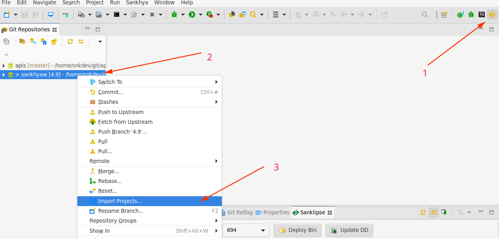

# TL;DR

Em resumo basta copiar e colar este comando no seu terminal:

`wget -O - https://raw.githubusercontent.com/computeiro/eclipse-snkdev/main/docker-eclipse-snkdev.sh |bash`

Deve demorar um pouco, mas em breve o Eclipse será lançado.
Nas próximas será mais rápido e a inicialização do Eclipse deverá ser feita com o comando:

`xhost +  && docker start eclipse-snkdev`

Sugiro que você crie um atalho com esse comando. Para quem usa Linux Mint, Deepin ou Ubuntu, há uma notícia boa,  fizemos esse atalho e pode ser instalado  com o comando:

`wget -O - https://raw.githubusercontent.com/computeiro/eclipse-snkdev/main/cria-atalho-snkdev-ubuntu.sh |bash`

 
 

# O QUE JÁ TEM NESSE ECLIPSE

:zap: Tem o FlashBuilder instalado!

:zap: Configuramos os filtros das views "Tasks" e "Problems", desta maneira ela vai exibir, respectivamente, apenas os problemas e as task **//TODO** e **//FIXME** do projeto selecionado.

:zap: Quando inicializa já realiza a obtenção das apis via Maven

:zap: Já vem com as JDK, Flash SDK e GWT SDK configuradas

:zap: Wildfly e JBoss embarcado com todos os "-D" da incialização e pronto pra uso

# DETALHES 

O script verificará a existẽncia do diretório **$HOME/git** e o clone dos projetos _"apis"_ e _"sankhyaw"_. Será feito clone dos dois repositórios se necessário. O diretório **$HOME/git** da sua máquina é passado como volume para o container, sendo lá o diretório **/home/snkdev/git**.

Sim, o usuário dentro do container é o **snkdev** e não poderia ser o root por conta da inicialização do Sankhya Om.

Antes do container ser inicializado é essencial rodar o comando `xhost +`, **não se preocupe o script faz isso**, é apenas importante você lembrar que esse comando perde efeito quando você reinicializa sua máquina, ou seja, entre uma parada e inicialização do container o 'xhost +' não é necessário, ao reiniciar a máquina sim. Esse comando está no script assim como todo o "`docker run ...`" necessário para criar o container.

O [docker-eclipse-snkdev.sh]( https://github.com/computeiro/eclipse-skdev/blob/main/docker-eclipse-snkdev.sh "Clique aqui e acesse o docker-eclipse-snkdev.sh aqui neste GitHub") cria o container e inicializa-o a primeira vez, para vocẽ que não é íntimo do Docker a criação é feita com o `docker run...` (veja no script)  o qual já tem um inicialização implícita, porém, se você quer inicializar um container que já está criado você usa o `docker start`. Por isso, nas próximas vezes você for inicializar o seu Eclipse com o comando (colocamos o xhost por garantia): 

`xhost +  && docker start eclipse-snkdev`

Eclipse inicializado, você pode importar os projetos do Sankhya Om que você utiliza e seguir sua rotina de trabalho.

Novos repositórios Git poderão ser adicionado no diretório Git que está na sua máquina, lembre-se mapeamos esse diretório como volume do container.
